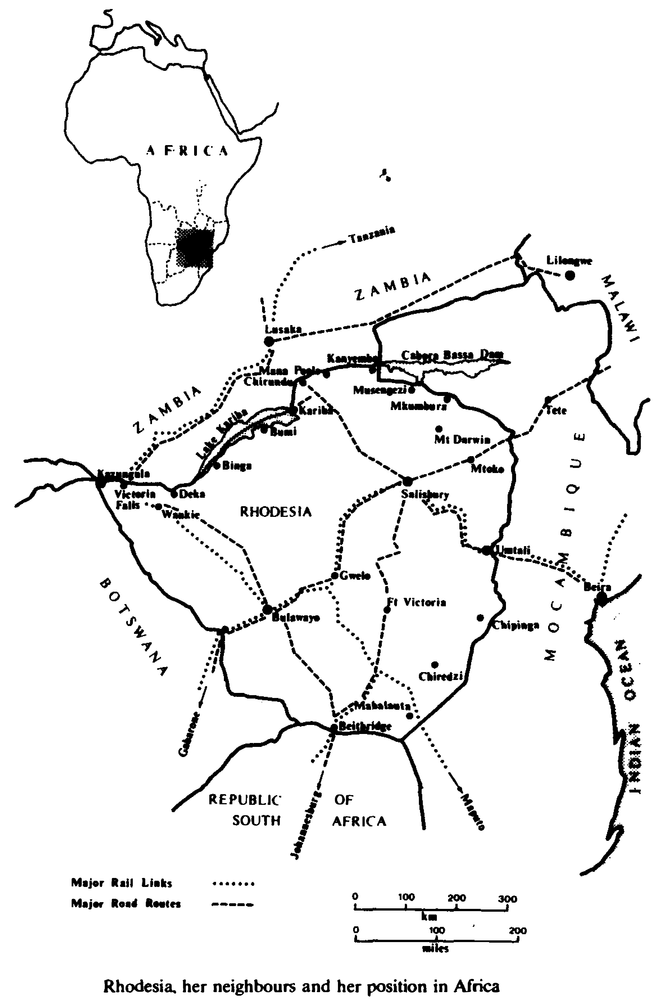

Distance for Rhodesians, wrote one military historian, has always made the heart grow patriotic. Rhodesians were certainly keen to do their bit for the “motherland” and their proud military tradition was second to none in the Empire.
No less than 64 percent of the country’s available manpower served in the First World War and when the world was plunged into war for the second time, the Rhodesians once again rushed to Britain’s aid.
The whole of Rhodesia volunteered almost to a man and restraints had to be brought in not to call people up ... but to _stop_ them going, for it was the only way to preserve the country’s essential services.
As it was, Rhodesia supplied more troops per head of its population to the British war effort than did any other country in the Empire. Some 6 650 white and 1 730 black Rhodesians served outside Rhodesia and more than a quarter of them served in the Royal Air Force, including the man destined to become the country’s most famous Prime Minister, Ian Smith.
He was a fighter pilot and after a long run of successes, one of which put him into hospital, he rejoined his Squadron to lead a strafing trip to the Po Valley picking on the most attractive targets of locomotives and fuel tanks. There was no sign of opposition and he made the mistake of going back for a second run.
As he pulled out of his dive, a resounding thud shook his Spitfire and he was forced to bale out, Later, while attempting to return to the Allied lines, he worked with the partisans, becoming a member of a company high command and inner war council planning and taking part in raids and ambushes.
Then 11 years after the war, Rhodesia’s proud military tradition was maintained when the Communists began giving trouble in the Far East and a Commonwealth Force was needed to help the United Nations in Korea. Rhodesia was still part of the Empire and only too willing to send a token force to Korea.
Only 100 men were wanted for the Far East Volunteer Unit Twelve times that number, including South Africans living in Rhodesia, volunteered Men and boys, old campaigners and civilians ... the scheme caught their imagination and it was all the able-bodied could talk about. It was an opportunity to put all that wartime experience into practice again; and for those too young for the last lot, here at last was their chance ...
The young Sandhurst-trained lieutenant who was to raise and train the force to fight Communist Terrorists on the other side of the world was Peter Walls. He could hardly have guessed that a couple of decades later, as Rhodesia’s Military Supremo he would again be leading Rhodesians in the fight against terrorism. Or that many of the successes of the Rhodesian war would largely be attributed to the experiences and lessons learned long before in Malaya.
There was another soldier destined to play a major part in Rhodesia’s military history. But in those days of the Far East Volunteer Unit, Ron Reid-Daly was very much a raw, inexperienced new boy.
In fact, going off to the other side of the world was the last thing the 22-year-old post office technician wanted, and he told the rugby friend who had “volunteered” his name for the scheme as much in no uncertain terms.
Then his mate dropped the magic word “parachuting” into the conversation and Reid-Daly began to think that perhaps it wasn’t really such a bad idea. After all, there had to be more to life than playing around with telephone wires for eight hours a day.
He decided to toss a coin to determine his future. If it was heads, he’d damn well chuck up his job and try his chances in the Far East If not, well, he still had his rugby and baseball, didn’t he?
It was heads - and the start of a soldiering career that would one day take Reid-Daly into the pages of military history as the extraordinary leader of Rhodesia’s famed unit, the Selous Scouts.
Ninety civilians and ten regulars, some of them with wartime service, were selected for the Far East Volunteer Unit and the average age was 24. Then they learned they were not going to Korea after all, but were destined for the bitter, unrewarding war in the foetid swamps and green hell of the Malayan jungle, where the fanatical Chinese Communists were waging a bloody revolution to seize control of the country in a campaign which had become known with some understatement as The Emergency.
In less than two years, the communists had killed more than 1 300 civilians, police officers and soldiers for the loss of more than 1 130 of their own men. One thousand terrorists had been captured yet still the war raged on.
By 1951, 5000 terrorists were firmly embedded in the remote heart of Malaya, hoping by frequent and savage attacks on the white population and the sabotage of key installations to force Britain to relinquish the valuable colony. Malaya’s rubber industry, the biggest in the world, had been brought almost to a standstill. British planters were being murdered at the rate of one a week and morale in Malaya was generally low.
With the terrorists’ detailed knowledge of the terrain, and the hit-and-run tactics which they had down to a fine art, they clearly had the upper hand.
The dense jungles, tall grass and endless swamps of inland Malaya where the water was full of tree roots and snakes, was certainly a terrorists’ paradise. Gangs would live in the jungle, emerging only to destroy stocks or machinery, slashing rubber trees, bringing production to a halt, ambushing convoys and trains, and extorting food from the vulnerable local population
The convenional troops kept to the fringes of the jungle, seldom making contact with the bandits.
An acknowledged expert on guerilla warfare, Major J.M. “Mad Mike” Calvert, holder of 13 decorations and a legendary character, was tasked to produce a detailed analysis of the rapidly escalating jungle war together with recommendations for its solutions. Calvert’s study later formed the basis of a controversial strategy named the Briggs Plan after the British Director of Operations, General Sir Harold Briggs, who put it into effect.
It was clear to Briggs that terrorists had to be denied access to the local population. This would not only cut off the terrorists’ intelligence and source of food supply but would protect the villagers ... and some 410 villages in the affected areas were uprooted, and entire rural Chinese populations were moved to new, fortified villages.
Briggs’s other recommendation was that if the enemy was to be defeated, their base areas, training camps, courier lines had to be attacked and destroyed.
It would involve deep-penetration operations, taking on the enemy on their own ground, seeking, flushing out and destroying them, something conventional troops were not trained to do.
What was urgently needed was a special forces reconnaissance unit to live in the jungle denying the enemy sanctuary and rest. Calvert’s argument was that British troops should be able to survive in the jungle far longer than the maximum for an orthodox infantry patrol.
Calvert was instructed to form such a unit, known as the Malayan Scouts. They were to link up with 21 SAS, the territorial unit formed after the Second World War to form a regular unit to be known as 22 SAS (Malayan) Scouts. The Malayan Scouts part of the name would eventually fall away.
The aim of the unit was not so much to kill the enemy in great numbers but to harass them and drive them on to the roads and more civilized areas where other British Army units would do the killing.
With manpower being the first priority. Calvert began an intensive recruiting campaign traveling some 35 000 kilometres (22 000 miles) in three weeks in his drive for men. His whirlwind tour included a trip to Rhodesia. where, he briefed the 100 Rhodesians on the situation in Malaya.
The Rhodesians were to be known as C Squadron SAS (Malayan Scouts) and would wear identifying Rhodesian shoulder flashes. There was also an A and B Squadron, British Amy formations, and later, a D Squadron and full headquarters, to complete the regiment.
The idea was for Peter Walls and his second-in-command, Lieutenant Ron Campbell-Morrison to train the Rhodesian contingent, after which, an older soldier with wartime experience would take over command and take the Rhodesians to Malaya. A British-trained Major would then be appointed as their squadron commander, should they stay together and not be split up.
In the event, the Rhodesian Army could find no one to take the token force to Malaya. And Peter Walls, who described himself as no more than a “buckshee lieutenant”, was called in, told he would lead the force to Malaya ... and that he was now a temporary captain.
The newspapers were full of stories of the lucky 100 men. and their spirit of adventure and loyalty to the Commonwealth was greatly admired by all.
When they marched ofT on the first leg of their journey to Malaya, the scene resembled that of a wartime victory parade. It looked like the whole of Salisbury had turned out to line the streets as the volunteers decked out in jungle kit and bush hats, proudly marched from the city centre to the railway station. There, to give them a typical wartime send-off, were 3 000 cheering friends and relatives.
To the strains of _Auld Lang Syne_ and deafening applause, the train pulled out of the station en route to South Africa – and adventures unknown.
Four days later they arrived in Durban where they boarded a Dutch liner, and set sail on a journey that would take them to the other side of the world for almost two years. Ahead lay the jungle, hot, humid, hostile - very much unknown. And it was an excited and apprehensive group of young Rhodesians indeed who disembarked into the stifling Singapore heat of a March day in 1951.
A couple of days later they got their first really good look at Malaya on the tram journey to Kuala Lumpur en route to their regimental base camp at Dusun Tua where they met up with the men of B Squadron.
“A” Sqn. they would soon learn, was made up of some “fairly interesting characters” some whose discipline left much to be desired, and some of whom were unwanted by their own regiments. “A” Squadron comprised men from units in the Far East and no particular criteria had been set down for selection. Such was the urgent need for men that to have been too discriminating would probably have meant the unit would never have been resurrected.
Despite their shortcomings, they did have some very good jungle soldiers and fine officers, and the Rhodesians would be impressed with the way some men could use themselves around the jungle. They had some excellent navigators and navigating was no easy task where it was often impossible even to see the sky.
“A” Squadron too spent the longest single spell in the jungle and returned from their record-breaking four month jungle stint shortly after the Rhodesians arrived at the camp.
When their convoy pulled up, it was a desperate-looking bunch of men indeed who piled out. The new boys from Rhodesia had never seen men looking so rugged and tough in all their lives.
They sported ferocious beards, their toes were sticking out of their canvas jungle boots and they all had pieces of ragged old yellow parachute silk carelessly tied around their necks.
“Is that the old debonair fighter pilot type thing?” curious young Rhodesian, Corporal Reid-Daly ventured of one man.
“My backside!” the veteran replied with feeling. “This is to stop us shooting at each other, everyone does it. You either put it on your hat or neck or somewhere. Then, if you see something move, you look for the colour. See?”
The Rhodesians clearly had much to learn about the ways of the jungle and the techniques of operating in the tight close undergrowth, just as men in the other Squadrons had. Many of the problems were unique to Malaya and the best way those pioneers had of finding out was to stagger into the jungle themselves and learn the hard way.
C Sqn got its first introduction to the jungle during a six-weeks training operation where they learned the ropes of jungle navigation and patrolling. The Rhodesians also learned to use their eyes and ears more than they usually did, sharpening their senses in the process.
The training, devised by Calvert, was directed at realism and live ammunition was used. Shooting fast from the hip at point-blank range was another skill that had to be mastered. The jungle was so dark in some places they would only be able to see a few paces in front of them and the undergrowth would have to be hacked away step by careful step ... and all providing wonderful cover for the quick-off-the-mark ambushing enemy.
By the end of the Rhodesians’ training operation, the British had decided against splitting the Rhodesians up and against putting a British officer in charge of C Squadron. Again Peter Walls was called in and told he had been appointed Squadron Commander and promoted to Acting Major.
Walls was only 24 and admits to being overawed at the challenge, particularly as a lot of older men with similar rank had rows of ribbons and years of experience behind them. However, he did have supreme confidence in his men. Rhodesians were used to being leaders at an early age and counter-insurgency depended greatly upon leadership, right down to the quality of a two-man patrol.
At first, the Rhodesians were confused when it came to tracking. It was completely different from tracking back home where the sun was a vital factor and where the dust, sand, rock, dry leaves, wild animals and their habits all helped.
In the jungle, the packed foliage blotted out the all-important sun and sky, reducing daylight to twilight and the only time they saw it was on the welcome occasions when they crossed a river or cut a helicopter landing zone. Only occasionally did the speckles of sunlight filter through the leaves of the sixty metre (200ft) high trees, intertwined at the top to form a canopy.
Seeking and flushing out the elusive bandits from the dense cover of their jungle sanctuary was uncomfortably hot work, too. Coming from Africa. the Rhodesians were well used to high temperatures, but the high humidity of the jungle took some getting used to, combined as it was with the heavy tropical rainfall which nourished the dense vegetation.
Major Calvert was invalided home suffering from an assortment of tropical diseases. and the SAS was withdrawn from the jungle for a period of reorganisation and retraining, during which some of the unruly types were sent packing and discipline was restored
When the SAS returned to the jungle. it was for a historic operation that marked the first large-scale airborne operation of The Emergency.
Parachutists were to drop into a remote almost inaccessible jungle valley near the Malaya/Thailand border to take it from the terrorists. The locals in the Malay settlements there had been forced to supply the 100 terrorists with food, and the operation aimed to exterminate the bandits. evacuate the locals to safety. and destroy all the food supplies and habitation the bandits were likely to use.
Fifty-odd parachutists from B Sqn, plus one experienced Rhodesian paratrooperLieutenant Charles Pavlich - dropped into the Belum Valley. while ground units trekked through the jungle to link up with them.
There were strong air currents that day and only four of the paratroopers, including the Rhodesian. landed on the dropping zone. The others ended in trees but had been given thirty-metre long ropes to aid their descent. The mission was successful and the regiment went on to clear the bandits from the valley.
Most of the Rhodesians were parachute trained by the time their tour of duty ended. and when the second airborne operation was mounted in Malaya it was the Rhodesians who made up most of the numbers.
Off-duty, the Rhodesians became the best of friends with the black Fijians. making nonsense of some claims that the Rhodesians in Malaya were a shade too colour conscious. The troth was the Rhodesians with their background were better orientated towards mixing with blacks and coloureds than the average British troopie who seldom associated with them.
For the most part, the Rhodesians had been 8 bunch of inexperienced soldiers when they had left on their Far East adventure. They were young. new soldiers in a totally foreign environment But they developed as they went along. and had acquitted themselves well.
Peter Walls was awarded an MBE for his work in Malaya but says it was definitely in recognition of the entire squadron’s efforts.
The Rhodesians’ commitment lasted almost two years but the SAS Regiment went on to spend a total of nine years in Malaya perfecting their Jungle fighting. The Emergency was declared over in July, 1960. Their commitment over, the Rhodesians returned home, most of them reverting to civilian life.
For the few who did continue to make soldiering their career, the Malayan experience had provided a tremendous grounding. Malaya had been a valuable experience and they had learned the elementary principles of counter-insurgency warfare.
They learned the technique of tracking; had learned what it was it like to be ambushed; what the principles were in establishing their own ambushes; the sort of things that could give them away.
These and others, were the sort of pertinent lessons that were taken home and adapted to local conditions and developed way beyond the original.
Peter Walls and Major (later General) RRJ. Putterill who had been to Kenya to study the Mau Mau campaign. were to pass on their knowledge at rural training camps.
The Combined Operations concept introduced in Rhodesia in 1977, where the military and civil forces all worked together with the common purpose of prosecuting the war and defeating the enemy 24 hours a day. seven days a week. under one supreme commander, stemmed from those Malayan days.
“The terrorists don’t play golf on Sundays, we won’t play golf on Sundays,” the dynamic Governor and Supremo of Malaya, General (later Field Marshall) Gerald Templar had ruled.
Templar’s comment made a lasting impression on young Peter Walls, who would one day be appointed to a post similar to Templar’s. That remark became a catchphrase of his over the years.
Major-General Putterill, OBE, who as Army Commander, presided over Rhodesia’s own COIN operations from 19666-1968, believed that Walls ranked alongside Templar as one of the finest modern operational practitioners of counterinsurgency warfare. (interview with Michael Evans).
The protected village idea where the vulnerable, unarmed local population were moved and resettled into villages to deprive the enemy of his target and means of support, while providing better community facilities and a more sophisticated infrastructure, was also introduced in Rhodesia.
Even so, Peter Walls says, had some of the experiences and lessons been implemented earlier, the Rhodesian troubles might well have been stamped out in their infancy. Whereas the Rhodesian Army and Air Force had learned from the overseas experiences, the Police who had never been overseas didn’t have such a fund of experience to draw upon.
When it was pointed out that the same pattern was happening in Rhodesia as had happened In Malaya and Kenya, the Police refused to accept this. Their view was that they did not need to heed the lessons and learn from the experiences of people in other countries. Rhodesia, the police argued. was not the same as Malaya or Borneo; they had their own methods.
Their minds were not attuned to trying new methods, the author was told. And the country’s top-level Security Council supported the view that the Police knew best.
C Sqn was disbanded on its return to Rhodesia, but the value of the SAS concept could be clearly seen. And when thoughts of establishing a parachute unit were first mooted in the days of the Federation of Rhodesia and Nyasaland several years later, someone suggested: “Well, if we’re going to go for parachuting, let’s go the whole hog and have the best Let’s have the Special Air Service.”
and that’s precisely what happened ...

