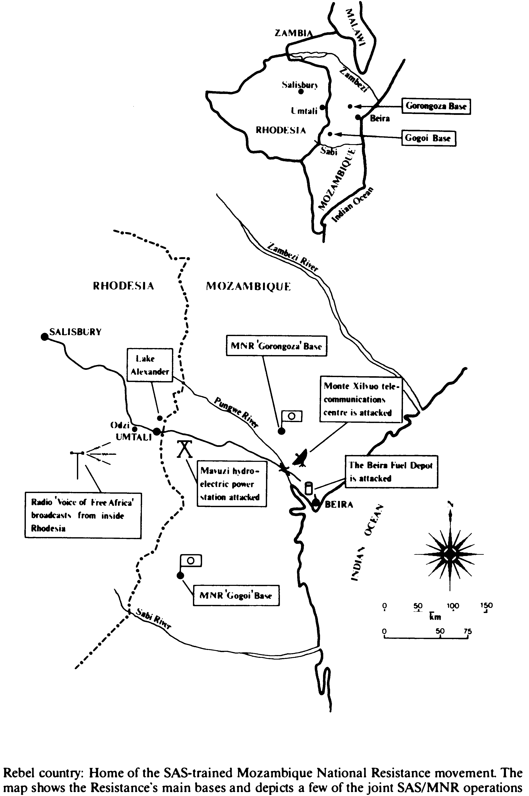

“It was war, and in war  
All things are allowed.”  
— KEN FLOWER, HEAD OF THE RHODESIAN CENTRAL INTELLIGENCE ORGANISATION

There are many ways of fighting fire with fire and in dark days of 1976 when the storm clouds began to gather over the country and the situation didn't look like improving, it became obvious to the Rhodesians that a new approach was necessary.  
After the lull following the assassination of ZANLA operations chief, Herbert Chitepo - the man behind the 1972 offensive - ZANLA had moved their headquarters from Zambia to Mozambique where they were being provided with a safe haven and crucial rear base facilities. They had resumed the war with a vengeance and were flooding across the entire length of the rugged largely-exposed Mozambican border at an alarming rate.  
Robert Mugabe and his two military commanders, Josiah Tongogara and Rex Nhongo, had based their strategy on continuous infiltration through the thick bush border of eastern Rhodesia. The mountainous Houde Valley became an infiltration corridor while the tribal trust lands became tunnels for the insurgents in which they could merge with the local population, according to military historian M Evans.  
[1][] They began their series of rolling infiltrations into the eastern highlands and south eastern lowveld in February, 1976, with the threefold objective of infiltration saturation to stretch the Rhodesian military membrane to breaking point ... disruption of Rhodesia's vital road and rail links with South Africa to damage tourist and export traffic ... and the harassment of the agricultural economy by attacking the prosperous timber, tea, fruit and cereal producing estates in eastern Rhodesia.  
[1][] Farmers were ambushed. roads mined and black labour dispersed. the intention being to wreck the country's commerce. The lTLs were used as launch pads for attacks against the government infrastructure, and African council offices. stores and cattle dips became soft targets.  
[1][] In Mozambique, Robert Mugabe followed the Chitepo strategy and began to expand ZANLA by creating a network of transit and staging bases. while shuttling recruits to Tanzania under Chinese instructors.  
Then, Samora Machel announced he was putting his country on a war footing and closed the border with Rhodesia. Overnight Rhodesia lost her links to east coast ports and an outlet for a high percentage of her exports. (Rhodesia had however, anticipated the problem and had been diverting traffic by rail via South Africa and Botswana.)  
But the pressure was mounting, the war was escalating and resources and manpower were limited. The threat on the military level was serious.  
The problem facing the Rhodesians was whether they could sit back and quietly allow Mozambique to support and export violence and terrorism? It was obvious that if they were to prevent the country being overrun, they could not. The time had come to hit back.  
Mozambique and not just ZAN LA was an enemy and something drastic had to be done to counter the increasing threat from the east.
How Rhodesia proposed to defend her borders and pre-empt that threat was to remain one of the best-kept secrets of the war. Rhodesia, already masters of the innovative, tactically flexible approach, now planned an even more unconventional counter-insurgency campaign in her war against ZANLA.  
As head of the Central Intelligence Organisation Ken Flower explained later. "It was war and in war all things are allowed."  
  
The plan for the highly sensitive operation was unfolded in a letter that appeared on the desk of a senior CIO officer one morning in 1976. His brief was simple:  
Making use of the strong anti-FRELIMO feeling that already existed in Mozambique, he and his department were to establish a black resistance movement ... conduct a psychological and clandestine campaign against the Marxist Mozambican government - and create a sufficiently strong opposition to challenge the existing authority.  
Thus Rhodesia, committed to stopping guerillas taking Rhodesia by force, was to actively encourage an organisation with a similar motive in neighbouring Mozambique.  
Should the plan succeed, Machels' Marxist administration would be replaced by a democratic western-orientated government one sympathetic towards Rhodesia ... and one inclined to boot ZANLA out of Mozambique.  
That, of course, was the long-term plan. Until such time as that happened, the Mozambique National Resistance Movement (also known as Renamo) would indirectly assist Rhodesia achieve her prime role to destroy, hinder and disrupt ZANLA forces operating out of firm bases in Mozambique.  
For in addition to eliminating FRELlMO in their bid to take the country. a Rhodesian-supported resistance movement could be well placed to provide an intelligence network on ZANLA rear bases and movements inside Mozambique…. information that could be passed back and followed up by Rhodesian security forces.  
But whilst top priority was placed on the secret operation, the mission was beset with problems, the least of which was that because of the strains on the country’s limited resources, no money had been made available to the CIO. To make matters worse, they were given no weapons - and no time-scale.  
Undaunted by the difficulties. the CIO officers pressed on with what they could. They spent most of 1976 studying the mood among Mozambians in the border area, confirming original assessments that there was indeed an intense hatred against FREUMO.  
When FRELIMO had taken over the reins of office, they had promised the earth, But things hadn't quite gone as planned and life for the average Mozambican was much worse than it had been in colonial times. There was much to feel bitter about.  
No one had been more taken aback than FRELIMO when, in the wake of the Lisbon coup, the terror group had suddenly been handed Mozambique on a platter. It was what they had been fighting for all along, but when it happened, they were totally unprepared. They had no idea how to run the country and no structure to cope with it.  
A very hard attitude was taken against the Portuguese and they streamed out of the country in droves taking their finance and expertise with them, leaving the country's twelve million blacks to pick up the pieces. Thousands lost their jobs and the white brain drain left a huge vacuum in the administration and general running of the country.  
Soon, Mozambique had become one of the world's poorest nations with the UN officially listing it as an undeveloping country.  
Within a month of independence. Machel had made sweeping changes, nationalising land, schools, hospitals and funeral parlours. Next came rented buildings and the gradual take over of companies. Freedom was eroded. The enforced communal system of agriculture caused production to fall drastically, and nationalised factories operated at reduced speed. All was not well.  
Yet, despite the intense natural hatred for FRELlMO, few Mozambicans were willing to take up arms at that stage. Certainly not enough to form an army. And even if there were, there were no weapons for them.  
Then came a new development in the raising of the rebel army, The CIO began their bitter war of words, using as ammunition, the power of the pen and FRELlMO's poor track record.  
To crystallise the hatred and discontent against FRELIMO and to push the Mozambique National Resistance creed out to the common man, they started an undercover radio station _The Voice of Free Africa_ using a huge old-fashioned 400 kilowatt transmitter nicknamed _Big Bertha_, said to be based "somewhere in Southern Africa", but actually situated in Gwelo.  
The staff of _The Voice_ monitored Mozambique's news commentaries, immediately rewrote them to support the Mozambique National Resistance and then pushed their own communiques back into Mozambique.  
The results were immediate and encouraging.  
Soon people were switching off _Radio Maputo_ in favour of _The Voice_ and it wasn't long before _Radio Maputo_ became too frightened to say anything for fear of the treatment their communiques would get. Eventually, Machel became so worried about the harmful effects of the radio station that he called in the East Germans to silence it. But the transmitter was just too powerful to jam, even with the most sophisticated equipment.  
Such was the response to _The Voice_ that the CIO planners were then faced with the embarrassing situation of having countless FRELIMO deserting to join the resistance - but being unable to find it because it existed in name only.  
Apart from confirming there were now people willing to do something positive about overthrowing Machel, it was obvious that unless the CIO got their military programme off the ground, they would lose that support. For while grievances existed, the guns still did not.  
Then, after months of not really getting anywhere, things started to happen.  
Several countries around the world began to see the swing to the east in Marxist Mozambique, and having been sold on the concept of the pro-western resistance movement, saw it as a suitable alternative. They came up with the necessary finance, and although the CIO would have liked more, there was enough to buy arms for the handful of recruits who had been rounded up.  
Training recruits for the top secret operation began at an isolated farm, at Odzi near Umtali, and initially the CIO made the mistake of using Portuguese men to train and boost the MNR's numbers. The Mozambican blacks under training resented them, thinking they were trying to recapture Mozambique for themselves… and they were replaced by several former SAS men, working with the CIO.  
But there was one vital ingredient still missing. The rebel force had no dominant leader, no inspiring figurehead, so necessary in a guerilla movement.  
Then, one day, a former FRELlMO platoon commander, Andre Matangaidze, escaped from a FRELIMO re-education camp and made his way across the border to Umtali. He had heard all about the resistance recruiting campaign and the idea fascinated him. Having been locked up by FRELIMO, he had a definite axe to grind and sought out the resistance recruiters.  
He had the remarkable charisma of a born leader and he had no fear ... and what's more, he assured CIO that attracting FRELIMO to the ranks of the infant resistance movement would be easy. CIO recognised Andre's potential immediately and struck up a deal with him - if he could get the men, they would groom him for the MNR leadership.  
To prove he could come up with the goods, Andre's first task was to go back to Mozambique with a nucleus of resistance men, attack his old re-education camp at Gorongoza, and release all the prisoners, most of whom were former FRELIMO soldiers.  
It was a tall order, but Andre Matangaidze was as good as his word. When he and his small band of rebels closed in on the camp, they did not hesitate.  
Led by the incredibly aggressive and inspiring Andre, they stepped from the shadows, mounted a successful attack - and released 500 prisoners. And that was that The Mozambique National Resistance movement had a leader.  
Three hundred released men opted to take to the bush and throw in their lot with the rebels. Together they set off for Rhodesia, stealing tractors and low loaders and shooting at any FRELIMO they came across on the long trek back to the border.  
The pattern had been set for the future. Andre had proved it was possible to mount such daring attacks and get away with them. He had put new life into the movement and it was obvious from the start that his men would have followed him anywhere.  
It was mid-1978 and Mozambique's second war of liberation was about to begin.  
From then onwards, the resistance would go from strength to strength, with the response to recruiting so overwhelming that it would become difficult to keep pace with, and potential recruits would often have to be turned away.  
Soon the rebels were notching up an amazing string of successes about the country-side and FRELIMO were faced with similar running bush warfare tactics they had used when fighting to wrest independence from the Portuguese.  
The rebels came up with a wealth of intelligence on the whereabouts of ZANLA bases and this was followed up by the Rhodesians.  
When ComOps suggested the MNR attack ZANLA the CIO pointed out that as the resistance's main objective was to overthrow Machel, the very last thing they wanted at that stage was to become involved with ZANLA.  
The CIO won the day that time, but ComOps had their own way later when FRELIMO started using ZANLA against the increasingly troublesome rebels. That so irritated the resistance that they carried out spontaneous attacks on ZANLA - and it was an added bonus for the Rhodesians.  
Politically. a number of splinter organisations and moderate factions were looked at by the CIO, including several which had returned to Portugal. But in the end, it was decided to concentrate on the military who were indoctrinated politically anyway.  
Africans are born politicians and it was felt that when the time was right, a natural political leader would emerge as an alternative to Machel.  
In January. 1979. the SAS began operating with the resistance and later, small ad hoc groups were attached to them in a training and advisory role.  
  
Their operational relationship got off to a spectacular start with a successful attack on the Mavuze hydro-electric power station on Chicamba Real Dam.  
Having knocked out the turbines - the dam's sole generator - and a transformer station with 75 millimetre recoilless rifle projectiles, Corporal _Lucy_ was down to his last target ... and his last projectile. The target, the valve house, was a good two kilometres away on top of a hill ... a mere speck on the horizon with just the faintest glow of the coming day piping the edges.  
It was a long shot and he told the commander as much. But there was no need to worry. _Lucy_ was on the ball and hit the jackpot with chilling precision. Then to round off the night's work, the SAS and MNR blew down an electricity pylon.  
Suddenly, over and above the crunching of the ailing turbines, came the unmistakable sound of tank guns firing at them. It was no time to be caught in the middle of FRELIMO manoeuvres and they hurried away, crossing rivers and anti-tracking as they went. The heat was on and they had far to go.  
They walked all that day and most of the night and managed to shake the enemy off. It was one of the longest walks the operators ever had. By the time they reached their LUP, their round trek totalled 120 kilometres (74,5 miles) and some of the men had lost so much weight that they were having to keep their trousers up with string.  
Despite the long walk and the untimely arrival of FRELIMO, the SAS and MNR had severed the electricity supply to a vast part of Mozambique and it would be some time before the damage was repaired and service restored.  
The MNR's local knowledge had played a significant part in the success of the mission. They had guided the SAS to the target and had been used as "faces" among the local population - gathering intelligence and spreading the MNR gospel - while the SAS remained under cover ... and it was to become their _modus operandi_ for joint missions from then onwards.  
  
The rebels designed their own flag and badges and eventually reached the stage when they felt they were making headway. The time had come to establish semipermanent bases inside Mozambique where new recruits could come for training and rally to the flag. Such bases would also enable them to extend their activities more rapidly.  
One operational base was established in the hilly, heavily-wooded countryside at Gogoi 35 kilometres (22 miles) from the Rhodesian border, while the headquarters and nerve centre of the rebel organisation was deep inside Mozambique in the thick bush of the remote Serra Da Gorongoza mountains of Sofala Province.  
  
Rebel country: Home of the SAS-trained Mozambique National Resistance movement. The map shows the Resistance's main bases and depicts a few of the joint SAS/MNR operations
The Gorongoza hideaway - formerly used by FRELIMO during their own war against the Portuguese - was the perfect geographical setting. There were meadows, valleys, clear streams for water, a fringe of forests, all 1 863 metres (6 100 feet) above the lowlands and providing excellent concealment and overhead cover from FRELIMO planes, together with a view of all the major roads and surrounding countryside.  
Often, the enormous fiat-topped plateau was shrouded in mist and rose 300 metres out of the top of the clouds. There was something mystical about the mountain, too, and it held many spiritual connotations for the rebels. The SAS who went there sensed a certain eeriness about the rain forests.
The MNR leader was to be based at Gorongoza and a small SAS group under the command of Lieutenant Charlie Buchan accompanied Andre and 200 of his men from the training farm in Rhodesia on the long trek to Gorongoza, a three-week journey punctuated by ambushes and contacts.  
When Andre decided they needed money and rations on the way, he sprang an impromptu raid. While the small SAS contingent remained off in the distance to deal with any FRELIMO reaction force, Andre led his men into the FRELIMO town and sacked the bank and the shops. Then, whatever money and food he didn't need for his rebels, he gave to the locals.  
From the start of their war to oust FRELIMO, "hearts and minds" played a big role in the MNR's campaign to win the Mozambican masses over to their side. Initially, as they had no other means of supply, every patrol staggered into the bush weighed down with salt, food and seeds to give the villagers. Salt was worth its weight in gold and was often their passport into an area.  
Initially, the SAS suspected that Mozambique's long-suffering masses might be friendly to anyone who turned up with an AK. But they soon learned that the support for the rebels was spontaneous and genuine, and the locals hated FRELIMO with great intensity and were glad someone was doing something to get rid of them.  
The locals welcomed the MNR wherever they went and little bands of people along the wayside would join their columns, swelling the rebels' ranks.  
The movement was going from from to strength. _The Voice_ of Free Africa was continuing to beam out its message to good effect. The MNKs long string of successes - all confirmed by intercepts monitored by sophisticated equipment - were broadcast throughout Mozambique. Everyone knew of the resistance. Everything was going well.  
Then, in October, 1979, disaster struck.  
Assured that there were good pickings to be had in Gorongoza town. Andre together with 110 men planned to attack the place. Such was Andre's aggressiveness and determination that the 400 FRELIMO and six tanks in the town did not deter him. When the SAS captain working with him at the time pointed out the differences in strength, Andre laughed and said he was confident FRELIMO would run away when attacked.  
Andre split his team into two and personally led the attack on the enemy base camp, across 400 metres of open ground, up a sharp rise and against FRELIMO trenches dominating the area. But this time, FRELIMO did not stick to their normal pattern and run away - and the MNR leader was mortally wounded.  
The loss of the incredibly brave, charismatic leader who had so inspired his men, hit the MNR hard. The tragedy was, it was all so unnecessary too, as he had been warned of the risks he ran by his personal involvement in attacks and advised to direct operations from his headquarters. But Andre had insisted on leading his men from the front and had paid the ultimate price.  
After a brief power struggle. Andre's deputy Alfonso Dhlakama, emerged the new leader. It was something he had not envisaged in his wildest dreams but when the opportunity presented itself, he grabbed it with both hands and with sheer dogged determination, overcame tremendous odds and measured up as a more than capable leader.  
In stature, he was a short bespectacled man, whereas the other main contender was a big burly individual, whose physique alone contributed to his leadership of men. The well-educated Alfonso Dhlakarna, on the other hand, was much more of the intelligensia, and eventually that was where his strength lay and how he won his troops over.  
Yet, despite the brief internal upheaval, the resistance continued operations, proving themselves a viable proposition. ComOps was impressed with their results and suggested that the SAS now get more positively involved with the rebels, attaching larger groups in their classic role of supporting and guiding the resistance.  
The few SAS who had been involved with the MNR to date considered the resistance highly motivated and well worth supporting - and, knowing the contribution the SAS could make, the CIO were fully behind the suggestion.  
As for the SAS, the MNR operation - codenamed _Bumper_ - marked a new and interesting facet in their counter-insurgency war and much thought and preparation went into their resistance programme, just as it did with all their many and varied operations.  
The SAS could, of course, draw on their many years of unique experience. When they operated on the Rhodesian side of the border, they did so as counter-insurgency experts. When they worked externally, they operated as guerillas and their own impressive string of successes bears testimony that they were good at that role, too.  
But there were always lessons to be learned from other campaigns, and Captain Bob McKenna, whose ''C'' Squadron was to go into the MNR camps first, and Lieutenant Pete Cole, off “B” Squadron, who was to take over from them, got together to study the whole spectrum of counter-insurgency warfare and how it applied to the rebels and their own particular role. They read everything they could lay their hands on, both from the western viewpoint to the thoughts of Mao.  
They had many British Army pamphlets to refer to and American-born Viet Nam veteran Bob McKenna had the benefit of experience with American special forces, whose particular role was to train indigenous guerilla movements.  
His collection of US special forces pamphlets and field manuals became their blueprint for everything they needed to know- from how to get to the guerilla camps ... politicizing the locals ... to growing crops and becoming self-sufficient. Very little modification was needed as the American special forces envisage that the guerillas the operators would be working with would be peasants, as was the case in Mozambique.  
The main difference between the American forces and that of the Rhodesians was that Uncle Sam provided US troops with all the support in the world ... whereas the Rhodesians were unable to give their men as much help as they would have liked.  
The SAS set up their tactical headquarters in a deserted farm at Odzi, close to the MNR's secret training base inside Rhodesia, and groups were sent to Gorongoza headquarters and the smaller secret operational base at Gogoi.  
Alfonso Dhlakama had not long taken over as leader of the resistance and moved to Gorongoza and the SAS's first job was to help him build permanent structures on his mountain hideaway. The first team, under the command of Lieutenant Rich Stannard, slept in bivvies in the forests with the MNR while the camp was being built. They helped the rebels site their defences, build a rifle range and select access tracks. Later groups would build hospitals and underground caches for bulk ammunition, and reorganise the stores, teach hygiene and signals.  
They improved the rebels' shooting with the AK - the true weapon of the revolution - and the much-favoured RPG-7 rocket launcher. They taught the rebels how to be as devious as the SAS ... how to derail trains … where the best places were to lay ambushes and landmines ... and how to do it quickly.  
The Rhodesians, masters at improvisation, taught them how to salvage whatever could be useful to their cause ... how to fashion corrugated iron into buildings ... how the bits and pieces of old weapons lying around their bases could be cannibalised into workable weapons ...  
Self-sufficiency was essential and seed was flown in to them to start their own maize and vegetable gardens. Generally, guerillas in other conflicts were too mobile to grow their own crops and were forced to get their supplies from the locals. The MNR however, had no need to force Mozambicans to feed them - they readily gave what little they had - but local production was subsistence and couldn't hope to feed the growing number of rebels.  
Each platoon was encouraged to have a commissar to politicize the masses to convince them that one day they would be victorious and overthrow Machel … and ZANLA's system of holding all-night political meetings in villages was adopted by the rebels.  
There were some colourful characters, with a style all of their own. Some had spiky hair, others multi-coloured beads and many had sweat bands, or maybe a monkey tail around their waists.  
When they moved off from Gorongoza and snaked their way through the thick bush on yet another operation, the commander's entourage would often carry a sunshade, a battery-operated transister or a tape recorder in a bag made from curtains stolen on another mission. Some carried folding tables and chairs for the senior personnel.  
Here and there a coloured helmet could be seen, legacy of a spell spent working on a South African mine. But the wearers knew that a vividly coloured hat could get a man killed when he closed for a contact, and he would exchange it for green headwear.  
Often the battalion tailor and his captured pedal sewing machine went along to do running repairs. For a mission could last months and it could take its toll on their uniforms and webbing.  
The weekly flag-raising ceremonies helped maintain discipline and morale. As the flag broke and fluttered in the breeze, the hundreds of rebels assembled around the parade square would begin singing and clapping.  
Within seconds, the clapping would grow in intensity and volume as the war cry of the rebel army rang out across the valleys and streams and floated down below the blanket of mist covering the Gorongoza hideaway to the thick bush of the lowlands.  
Soon, the familiar chant of _Basha FRELIMO_ would echo across the country. Then came FRELIMO's own and best-known slogan - _A Luta Continua_ (the struggle continues).  
There were other songs too - stirring. highly-motivating ones, telling how they were going to live in the bush ... sleep in the rain ... suffer every type of deprivation, taking on FRELIMO with their AKs and RPG-7s.  
Individuals would be singled out and praised for their efforts and groups congratulated. A chain of runners kept the resistance leader informed of a company's progress while on operations.  
With Rich Stannard's arrival at Gorongoza, a much more aggressive approach was taken than with previous attached groups. A combined SAS/MNR team attacked a FRELlMO farm at the bottom of the mountain range with cannon and mortar fire and when they swept down the mountain, FRELIMO had fled, leaving behind 75 000 rounds of AK ammunition, 200 x 82 millimetre mortar bombs, 200 x RPG7 rockets and a dozen rocket launchers to be captured and used by the rebels in the classical guerilla war tradition.  
There were vast quantities of grenades and heavy weapon ammunition, blankets, tents - one which became the MNR leader's operations room - marquees, a kitchen unit, food and 170 cattle.  
It had been a good day's work and there was much singing and partying up on Gorongoza that night with the SAS firmly acknowledged as thoroughly good chaps to have around. To honour their advisers, the rebels made the SAS gifts of goats and piglets, and later presented them with bottles filled with wild honey gathered from trees in the endless valleys.  
Soon, the SAS had moulded the resistance into an organised workable system. MNR morale went up immediately the SAS became involved with them, and operational results improved considerably.  
"The presence of the SAS with their expertise has advanced the MNR in both training and operational fields, and accelerated their progress beyond measure." the CIO commented.  
As each month went by the MNR gained new ground. and became accepted by a vast proportion of the population as a viable opposition to the Machel government Every successful ambush produced more captured weapons, food and great experience.  
The movement continued to grow in popularity with civilians, and disillusioned government troops were attracted to their ranks, They didn't have much, before they joined the rebels' ranks so the excitement and comradeship they had with the resistance was certainly a 'big improvement compared to the dull, poor life in the countryside.  
They were convinced their cause was just' that there had to be a better way of life; that they could secure a better future for the~selves, No one thought it would be the following day. But perhaps one day …  
When the MNR first began its campaign to topple Machel, _Radio Maputo_, referred to the rebels as “bandits”. By 1979, they had changed their tune and were calling them “the enemy”. So seriously did he take the MNR, and so alarmed was he at the widespread nature of their activity, that Machel was forced to withdraw 200 FRELIMO operating inside Rhodesia in support of ZANLA.  
  
By 1980, events were moving quickly in Rhodesia, There was a fragile ceasefire and the country was gearing itself up for its first all-party British-supervised elections. The British monitoring forces were on the tail of the SAS and although they suspected they had been working externally with the MNR, they couldn’t catch them at it.  
Machel had saved the Lancaster House talks by persuading Mugabe to stay talking at the conference table and to repay the favour, the British put a stop to the rebels' Rhodesia-based radio station.  
While the CIO denied any connection with the station, the British - then in control of the country - knew better, and _The Voice of Free Africa_ went off the air in February, 1980.
The rebels' training camp inside Rhodesia was closed down and the CIO and SAS connection with the rebel army ceased.  
It was not, however, the end of the Mozambique National Resistance. Things had come a long way since those early days of 1976 and the resistance was now some 5 000 men strong. Left to determine their own future, they were sent rejoicing into the bush to begin a new and successful chapter in their campaign to topple Machel.  
While the MNR had provided an excellent intelligence network, the plan to overthrow Machel and install a government sympathetic to Rhodesia had been overtaken by time and events. And yet, say CIO officers, it might well have been different.  
Had the necessary arms, money and other resources been available when the idea was first mooted and a definite time-scale been set, they feel they would have been able to accomplish the aim. By the enforced delay in getting established. they had created their own problems as the resistance within FRELIMO had built up accordingly.  
Whilst they would have had to convince the purist conventional military man that the use of guerilla troops was a viable alternative, the CIO felt that the MNR could have brought about a change of government in Mozambique ... ZANLA could have been kicked out of Mozambique ... and the Rhodesian war could have been all over bar the shouting by 1978/1979.  
As for the SAS, they had played their part and felt that helping to get the MNR going was one of the most lasting, significant missions of their careers. They had been faced with the potential of moulding one of the most formidable guerilla armies in Africa - and if the MNR's impressive string of successes is anything to go by, they didn't do too badly at it either.  
  
Postscript: At the time of writing, the Mozambique National Resistance movement is still a major force to be reckoned with in Mozambique, and FRELIMO have been unable to quell the rebels who are tightening their grip around the capital.  
With the historic signing of the Nkomati Peace Accord with South Africa. Mozambique, having embraced the east for so long. now seems set on turning to the west.  
Machel has pledged to bring stability to his country and peace 10 the region. But perhaps only dialogue with the leader of the MNR can bring genuine peace?  
In the meantime, the struggle for Mozambique continues…  


[1]: Michael Evans
